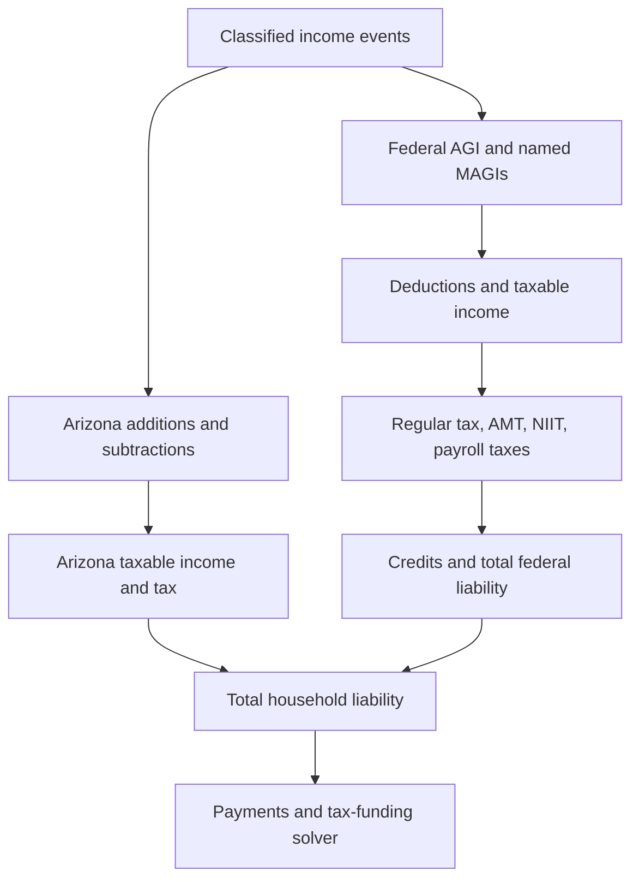

# Tax Rules Reference

## 2026 U.S. federal and Arizona implementation specification

| Field | Value |
|---|---|
| Research cutoff | 2026-09-10 |
| Base tax year | 2026 calendar-year individual returns |
| Primary use | Retirement and personal-finance projection engine |
| Jurisdictions | U.S. federal and Arizona resident individual income tax |
| Companion references | [ACCOUNT_RULES_ENGINE_REFERENCE_2026.md](ACCOUNT_RULES_ENGINE_REFERENCE_2026.md), [MARKET_DATA_ENGINE_REFERENCE_2026.md](MARKET_DATA_ENGINE_REFERENCE_2026.md), [FEATURES.md](../FEATURES.md) |
| Legacy input | `../archive/TAX_RULES_REFERENCE.md`, reviewed as a starting draft |

This document is an implementation resource, not legal or tax advice. It emphasizes rules that materially affect retirement projections and identifies cases that must be routed to an official worksheet or professional review. Dollar values are nominal unless a section explicitly says otherwise.

## Executive conclusions

1. The 2026 federal baseline is no longer a sunset scenario. Public Law 119-21 made the seven individual rate structure and the larger basic standard deduction permanent, while adding temporary and permanent provisions that require new engine inputs.[^2][^3]
2. A projection engine must not use one generic `MAGI`. Social Security provisional income, senior-deduction MAGI, NIIT MAGI, ACA household income, and other modified-income definitions differ.
3. Preferential capital-gain tax must be stacked on top of ordinary taxable income. Multiplying all long-term gains by 15% is wrong at both low and high incomes and is incomplete for collectibles, qualified small-business stock, and unrecaptured section 1250 gain.[^7][^8]
4. The enhanced senior deduction is separate from the regular age-65 additional standard deduction. Its phaseout is applied to each eligible person's $6,000 amount, so a married couple with two eligible spouses can lose $12,000 over the same $100,000 MAGI interval.[^3][^5]
5. For 2026, the AMT exemption phaseout rate is 50 cents per dollar above the threshold, not 25 cents. A legacy 25% phaseout implementation materially understates AMT at high income.[^2][^15]
6. The exact enacted 2026 federal SALT cap is $40,400, subject to a MAGI phaseout beginning at $505,000 and a $10,000 floor. The early 2026 Form 1040-ES overview rounds these to $40,000 and $500,000, so the statute and final Schedule A instructions should control a return-grade calculation.[^3][^4]
7. Arizona enacted HB 4168 as Chapter 140 during the 2026 second regular session. It updates conformity and creates Arizona subtractions for several federal below-AGI deductions. Its general effective date was scheduled for 2026-09-12, two days after this research cutoff, while specified provisions apply to named tax years, including retroactively in some cases.[^21][^22][^23]
8. Arizona's 2026 basic standard-deduction amounts can be derived as $16,100 single/MFS, $24,150 head of household, and $32,200 MFJ because the amended state bases and indexation track the federal basic amounts. Treat those figures as a high-confidence statutory inference until Arizona publishes final 2026 forms.
9. Tax liability, tax payments, and the cash withdrawn to pay tax are three different quantities. A plan that funds tax from taxable retirement withdrawals needs a fixed-point solver and must not count withholding as an additional tax expense.

## 1. Authority, status, and maintenance policy

### 1.1 Source hierarchy

Use sources in this order:

1. Enacted federal or Arizona law.
2. Final IRS or Arizona Department of Revenue forms, instructions, revenue procedures, notices, and publications.
3. Current codified statutes.
4. Official legislative summaries for interpretation and effective-date context.
5. Secondary sources only as discovery aids, never as the sole authority for a production parameter.
6. The legacy project document only for product intent or previously implemented coverage.

The uploaded legacy draft stated that figures had been verified against an engine. No engine source code or test output accompanied the upload, so this document does not carry that verification claim forward.[^1]

### 1.2 Parameter-status vocabulary

| Status | Meaning | Production treatment |
|---|---|---|
| `ENACTED` | Amount or rule is in enacted law | May ship, subject to later technical corrections |
| `OFFICIAL_2026` | Published in 2026 IRS, SSA, or state guidance | Preferred operational value |
| `INFERRED` | Directly derived from enacted text but not yet printed on the final return form | May ship with a visible provenance flag and a reconciliation test |
| `FORM_PENDING` | Final form or instructions could resolve mechanics or ambiguity | Do not silently claim return-grade precision |
| `MODEL_ASSUMPTION` | Projection convention, not tax law | Expose to users and scenarios |
| `UNSUPPORTED` | Engine does not have inputs needed for a reliable calculation | Stop, route, or return a bounded estimate with a warning |

Every stored parameter should include at least:

```text
jurisdiction, tax_year, provision_id, filing_status, value,
status, effective_from, effective_to, indexation_rule,
source_url, source_checked_at, form_or_code_reference
```

Do not overwrite a historical tax-year table when a later year is released. Add a versioned table and run regression tests for every supported year.

## 2. Calculation boundary and data contract

### 2.1 Keep three ledgers

| Ledger | What it answers | Examples |
|---|---|---|
| Economic cash flow | What entered or left the household | Gross distribution, spending, estimated payment |
| Tax return | What belongs on federal or Arizona tax forms | Taxable IRA amount, AGI, taxable income, credits |
| Account and basis | What changes future tax character | IRA basis, capital-loss carryover, lot basis, QCD usage |

The same event can affect the ledgers differently. A $20,000 QCD is an IRA cash outflow and can satisfy an RMD, but it is normally excluded from taxable IRA income. Federal withholding is a cash outflow and a tax payment, not an additional tax liability.[^17]

### 2.2 Required person-level inputs

- Taxpayer and spouse birth dates, death dates if applicable, blind status, and residency dates.
- Wages, Social Security wages, Medicare wages, federal withholding, and state withholding by person.
- Net self-employment income and the business-level adjustments required by Schedule SE.
- Social Security benefits by person.
- Pension and annuity distributions, including taxable amount and any recovery of basis.
- Traditional, SEP, SIMPLE, Roth, and inherited IRA distributions by account owner; conversions; QCDs; year-end balances; RMD status; and aggregate traditional-IRA basis.
- Interest classified as taxable bank interest, U.S. obligation interest, Arizona municipal interest, other-state municipal interest, or private-activity-bond interest.
- Ordinary dividends, qualified dividends, short-term gain or loss, long-term gain or loss, collectibles gain, unrecaptured section 1250 gain, section 1202 gain, and capital-loss carryovers.
- Rental, royalty, passive business, and nonpassive business income, plus directly allocable investment expenses.
- Above-the-line deductions, itemized-deduction components, charitable contribution types and carryovers, credits, estimated payments, and prior-year tax/AGI for safe-harbor calculations.
- Arizona-specific acquisition dates for assets generating long-term gain, qualifying government-pension amounts, U.S. obligation interest, other-state municipal interest, and state credit inputs.

### 2.3 Required named income measures

Never expose only a field called `magi`.

| Name | Intended use | Core definition |
|---|---|---|
| `federal_agi` | Federal return and Arizona starting point | Federal gross income less allowed AGI deductions |
| `ss_provisional_income` | Taxable Social Security | Pub. 915 comparison-income worksheet result |
| `senior_deduction_magi` | Enhanced senior deduction | AGI increased by amounts excluded under sections 911, 931, and 933 |
| `niit_magi` | Net Investment Income Tax | AGI with section 911-related modification under Form 8960 |
| `aca_household_income` | Premium tax credit | Separate ACA definition; outside this core engine |
| `arizona_agi` | Arizona deduction stage | Federal AGI plus Arizona additions minus Arizona subtractions |

### 2.4 Recommended computation order



Important dependencies:

- Taxable Social Security must be known before federal AGI.
- The deductible half of self-employment tax must be known before final AGI.
- The senior deduction is below AGI, but uses its own MAGI and affects taxable income.
- Preferential income uses total taxable income after deductions.
- NIIT uses MAGI and net investment income, not taxable income.
- Arizona begins with federal AGI, not federal taxable income.
- If taxable withdrawals fund tax, the withdrawal amount and liability must be solved together.

## 3. Federal 2026 parameter tables

### 3.1 Ordinary-income brackets

The following bracket ceilings are official 2026 values.[^2]

| Rate | Single | MFJ / qualifying surviving spouse | Head of household | MFS |
|---:|---:|---:|---:|---:|
| 10% | $12,400 | $24,800 | $17,700 | $12,400 |
| 12% | $50,400 | $100,800 | $67,450 | $50,400 |
| 22% | $105,700 | $211,400 | $105,700 | $105,700 |
| 24% | $201,775 | $403,550 | $201,750 | $201,775 |
| 32% | $256,225 | $512,450 | $256,200 | $256,225 |
| 35% | $640,600 | $768,700 | $640,600 | $384,350 |
| 37% | over $640,600 | over $768,700 | over $640,600 | over $384,350 |

Implementation should store upper bounds and marginal rates, then compute:

```text
ordinary_tax(x) = sum over brackets i of
                  rate[i] * max(0, min(x, upper[i]) - lower[i])
```

Return zero for `x <= 0`. Preserve internal cents and apply form-line rounding only at the reporting boundary.

### 3.2 Standard deduction and age/blind addition

| Filing status | 2026 basic standard deduction |
|---|---:|
| Single | $16,100 |
| Married filing separately | $16,100 |
| Head of household | $24,150 |
| Married filing jointly | $32,200 |
| Qualifying surviving spouse | $32,200 |

For 2026, each qualifying age-65 or blind condition adds $1,650 for a married individual or qualifying surviving spouse, and $2,050 for an unmarried individual who is not a qualifying surviving spouse. A person who is both age 65 and blind receives two additions. These amounts increase the standard deduction only; they do not apply when the taxpayer itemizes.[^2][^4]

A dependent's 2026 standard deduction is the greater of $1,350 or earned income plus $450, capped at the otherwise applicable basic standard deduction. Special zero-standard-deduction rules apply when an MFS spouse itemizes and in certain dual-status cases.[^4]

### 3.3 Enhanced senior deduction, 2025 through 2028

This is a separate below-AGI deduction available whether the taxpayer takes the standard deduction or itemizes. A qualified individual must be age 65 by year end, must have the required Social Security number, and, if married, must file jointly. The maximum is $6,000 for each eligible individual.[^3][^5]

For each eligible person:

```text
threshold = 150,000 if MFJ else 75,000
per_person = max(0, 6,000 - 0.06 * max(0, senior_deduction_magi - threshold))
senior_deduction = eligible_person_count * per_person
```

Consequences:

| Scenario | MAGI | Eligible people | Deduction |
|---|---:|---:|---:|
| Single | $75,000 | 1 | $6,000 |
| Single | $125,000 | 1 | $3,000 |
| Single | $175,000 | 1 | $0 |
| MFJ | $150,000 | 2 | $12,000 |
| MFJ | $200,000 | 2 | $6,000 |
| MFJ | $250,000 | 2 | $0 |

Do not phase out a couple's aggregate $12,000 only once at 6%. The statute reduces the amount with respect to each eligible individual. The deduction is temporary and scheduled to end after 2028. It is also an AMT adjustment under the current Form 6251 framework, so an AMT-capable engine must add it back when required.[^3][^15]

### 3.4 Qualified dividends and long-term capital gains

The thresholds below are total taxable-income thresholds, not standalone gain brackets.[^2]

| Filing status | Top of 0% band | Top of 15% band | 20% above |
|---|---:|---:|---:|
| Single | $49,450 | $545,500 | $545,500 |
| MFJ / qualifying surviving spouse | $98,900 | $613,700 | $613,700 |
| Head of household | $66,200 | $579,600 | $579,600 |
| MFS | $49,450 | $306,850 | $306,850 |

For ordinary 0%/15%/20% assets, a useful implementation form is:

```text
P  = min(taxable_income, max(0, qualified_dividends + eligible_net_long_term_gain))
O  = max(0, taxable_income - P)
G0 = min(P, max(0, zero_rate_threshold - O))
G15 = min(P - G0, max(0, fifteen_rate_threshold - O - G0))
G20 = P - G0 - G15

regular_income_tax = ordinary_tax(O) + 0.15 * G15 + 0.20 * G20
```

This simplified identity is not enough when the return contains collectibles gain, unrecaptured section 1250 gain, section 1202 gain, investment-interest elections, foreign earned income, or other Schedule D worksheet adjustments. Those cases must use the Qualified Dividends and Capital Gain Tax Worksheet or Schedule D Tax Worksheet in the current instructions.[^8]

Net short-term capital gain is ordinary income. Net capital loss offsets capital gain and then up to $3,000 of other income, or $1,500 for MFS, with unused loss carried forward. Wash-sale rules generally disallow a loss when substantially identical securities are acquired within 30 days before or after the sale and move the disallowed loss into replacement basis, subject to exceptions.[^7]

### 3.5 Social Security benefit inclusion

Let:

- `B` = net Social Security benefits.
- `P` = provisional or comparison income computed under the Pub. 915 worksheet.
- `L` and `U` = the applicable lower and upper bases.

| Filing status | `L` | `U` |
|---|---:|---:|
| Single, head of household, qualifying surviving spouse, or MFS who lived apart all year | $25,000 | $34,000 |
| MFJ | $32,000 | $44,000 |

For these ordinary cases:[^6]

```text
if P <= L:
    taxable_ss = 0
elif P <= U:
    taxable_ss = min(0.50 * B, 0.50 * (P - L))
else:
    taxable_ss = min(
        0.85 * B,
        0.85 * (P - U) + min(0.50 * B, 0.50 * (U - L))
    )
```

`P` is not simply AGI plus half of benefits. Build it from the current Pub. 915 worksheet, including tax-exempt interest and the worksheet's specified exclusions, additions, and adjustments. Municipal-bond interest can therefore make more Social Security taxable even though the interest itself remains federally tax-exempt. The MFS case in which the taxpayer lived with a spouse at any time during the year uses special zero-base rules and must route to the official worksheet. The 85% figure is the maximum inclusion fraction, not a tax rate.[^6]

### 3.6 Alternative minimum tax

| Filing status | Exemption | Phaseout begins | Complete phaseout | 28% breakpoint |
|---|---:|---:|---:|---:|
| MFJ / qualifying surviving spouse | $140,200 | $1,000,000 | $1,280,400 | $244,500 |
| Single / head of household | $90,100 | $500,000 | $680,200 | $244,500 |
| MFS | $70,100 | $500,000 | $640,200 | $122,250 |

For 2026 the exemption formula is:

```text
amt_exemption = max(0, base_exemption - 0.50 * max(0, AMTI - phaseout_start))
amt_rate_base = max(0, AMTI - amt_exemption)
```

The basic tentative-minimum-tax rate is 26% through the breakpoint and 28% above it. Preferential capital gains and qualified dividends retain special rates in Form 6251 Part III. Final AMT is generally the excess of tentative minimum tax over the defined regular tax liability, subject to foreign-tax and other form adjustments.[^2][^15]

Common AMT adjustments include the standard deduction, SALT and certain other itemized deductions, private-activity-bond interest, incentive stock-option exercise spread, depreciation differences, and the enhanced senior deduction. An engine without the underlying fields must not label `max(0, tentative_minimum_tax - regular_tax)` as exact. Detect the unsupported inputs and route to Form 6251.

### 3.7 Net Investment Income Tax

The 3.8% NIIT thresholds are fixed nominal amounts:[^9]

| Filing status | Threshold |
|---|---:|
| Single or head of household | $200,000 |
| MFJ / qualifying surviving spouse | $250,000 |
| MFS | $125,000 |

```text
niit = 0.038 * min(
    max(0, net_investment_income),
    max(0, niit_magi - filing_status_threshold)
)
```

Net investment income generally includes taxable interest, dividends, nonqualified annuity income, passive rents/royalties/business income, and net gain from property, reduced by properly allocable deductions. It excludes wages, unemployment compensation, Social Security, tax-exempt interest, qualified retirement-plan and IRA distributions, and active self-employment income. A taxable Roth conversion or IRA distribution is not itself NII, but it can increase MAGI enough to expose other investment income to NIIT.[^9]

### 3.8 Payroll, self-employment, and Additional Medicare tax

For 2026, the Social Security wage base is $184,500 per worker. Employee rates remain 6.2% Social Security and 1.45% Medicare; the employer has matching rates. The Medicare base is uncapped.[^10][^11]

```text
employee_social_security = 0.062 * min(ss_wages, 184,500)
employee_medicare = 0.0145 * medicare_wages
```

The 0.9% Additional Medicare Tax applies to combined Medicare wages, railroad compensation where relevant, and self-employment income above $200,000 single/HoH/qualifying surviving spouse, $250,000 MFJ, or $125,000 MFS. These thresholds are not indexed. Employer withholding begins when that employer pays one employee more than $200,000, regardless of filing status; that withholding is only a prepayment and can differ from final joint liability.[^12]

For a case without railroad compensation:

```text
additional_medicare_tax = 0.009 * max(
    0,
    medicare_wages + net_earnings_from_self_employment - status_threshold
)
```

Apply the form's ordering rules when wages and self-employment income coexist, and subtract Additional Medicare withholding only in the payments section.

For a common Schedule SE case:[^13][^14]

```text
net_earnings_from_self_employment = 0.9235 * adjusted_net_profit
remaining_ss_base = max(0, 184,500 - employee_ss_wages)
se_social_security = 0.124 * min(net_earnings_from_self_employment, remaining_ss_base)
se_medicare = 0.029 * net_earnings_from_self_employment
self_employment_tax = se_social_security + se_medicare
deductible_half_se_tax = 0.50 * self_employment_tax
```

Net earnings generally must reach $400 before self-employment tax applies. Multiple businesses, farm income, optional methods, church-employee income, railroad compensation, and community-property issues require the full Schedule SE logic. Additional Medicare Tax is calculated separately and is not included in the deductible half of self-employment tax.

### 3.9 SALT and charitable deductions

For 2026, the enacted federal SALT limit for non-MFS filers is:[^3]

```text
salt_cap = max(
    10,000,
    40,400 - 0.30 * max(0, salt_magi - 505,000)
)
```

For MFS, halve the $40,400 cap, $505,000 phaseout threshold, and $10,000 floor. Apply the result to the combined covered state and local income or sales taxes and property taxes, subject to the final Schedule A instructions. The temporary higher cap increases under its statutory schedule through 2029 and returns to $10,000 in 2030 unless the law changes.[^3]

The first 2026 Form 1040-ES overview describes $40,000 and $500,000. Those rounded figures conflict with the enacted 2026 indexation. Store $40,400 and $505,000 as `ENACTED`, and add a release test against final 2026 Schedule A instructions.[^3][^4]

Beginning in 2026, a nonitemizer may deduct up to $1,000 of qualifying cash contributions, or $2,000 on an MFJ return, subject to organization and contribution restrictions. An itemizer generally deducts only the qualifying contribution amount above a 0.5% of AGI floor; disallowed floor amounts can affect carryovers under the detailed rules.[^3][^4]

The new high-income itemized-deduction limitation applies after other limits. The 2026 Form 1040-ES describes the reduction as 5.4% of the lesser of total itemized deductions or taxable income above $768,700 MFJ/qualifying surviving spouse, $640,600 single/HoH, or $384,350 MFS.[^4] Because this is an early estimated-tax form and the taxable-income wording can create implementation-order questions, a return-grade engine should follow the final 2026 Schedule A worksheet when released. Mark this module `FORM_PENDING` until that reconciliation is complete.

### 3.10 Credits, payments, and estimated tax

Maintain separate outputs:

```text
income_tax_before_credits
nonrefundable_credits
other_taxes
total_tax_liability
refundable_credits
withholding
estimated_payments
balance_due_or_refund
```

Do not subtract withholding while calculating tax liability. For 2026, estimated payments are generally required when expected balance due after withholding and refundable credits is at least $1,000 and expected withholding plus refundable credits is less than the smaller of 90% of current-year tax or 100% of prior-year tax. Substitute 110% of prior-year tax when prior-year AGI exceeded $150,000, or $75,000 for MFS, subject to special farming, fishing, and other rules. Use of prior-year tax requires a prior return covering all 12 months.[^4]

The standard 2026 due dates are April 15, June 15, and September 15, 2026, and January 15, 2027. Uneven income, such as a late-year capital gain or Roth conversion, can require the annualized-income installment method rather than four equal modeled payments.[^4]

Most credits, QBI, foreign tax, education, dependent, clean-energy transition rules, and premium tax credit calculations are outside this core. A production engine should expose them as explicit modules or unsupported flags, never as an unlabelled zero.

## 4. Investment and retirement-account interfaces

### 4.1 Federal and Arizona classification matrix

| Cash-flow item | Federal ordinary AGI | Federal preferential income | NIIT input | Arizona treatment |
|---|---:|---:|---:|---|
| Wages | Yes | No | No | Included through federal AGI |
| Bank interest | Yes | No | Usually yes | Included through federal AGI |
| U.S. Treasury/obligation interest | Yes | No | Usually yes | Subtract qualifying U.S. obligation interest |
| Arizona municipal interest | Usually federally exempt | No | No | Generally no addition |
| Other-state municipal interest | Usually federally exempt | No | No | Add to Arizona gross income |
| Ordinary dividends | Yes | No | Usually yes | Included through federal AGI |
| Qualified dividends | Included in AGI | Yes | Usually yes | Included through federal AGI |
| Net short-term gain | Yes | No | Usually yes | Included through federal AGI |
| Eligible post-2011 net long-term gain | Included in AGI | Yes | Usually yes | Subtract 25% of qualifying amount |
| Social Security | Taxable portion only | No | No | Subtract the federally taxable portion |
| Taxable pension | Yes | No | No | Possible $2,500 qualifying government-pension subtraction |
| Traditional IRA distribution | Taxable portion | No | No | Included through federal AGI, subject to specific state subtractions |
| Roth conversion | Taxable amount | No | No, but raises MAGI | Included through federal AGI |
| QCD | Normally excluded | No | No | No federal-AGI amount to subtract |
| Qualified Roth distribution | No | No | No | No federal-AGI amount |
| Passive rental income | Yes | No | Usually yes | Included through federal AGI |
| Active self-employment income | Yes | No | No | Included through federal AGI |

Arizona classifications are governed by the current additions and subtractions statutes and Chapter 140 changes.[^21][^25][^26]

### 4.2 IRA basis, conversions, RMDs, and QCDs

- Tax the taxable amount, not the gross distribution. Nondeductible basis is generally aggregated across all traditional, SEP, and SIMPLE IRAs on Form 8606 rather than tracked as a freely selectable tax-free account lot.[^17]
- A Roth conversion is ordinarily taxable to the extent it exceeds allocable basis. It can increase taxable Social Security, senior-deduction phaseout, NIIT exposure on other income, Medicare premium measures outside this tax engine, and Arizona income.
- A QCD must be paid directly by the IRA trustee to an eligible charity, is available after age 70 1/2, and can count toward the year's RMD. The 2026 annual exclusion limit is $111,000 per eligible person. Post-age-70 1/2 deductible IRA contributions can reduce the excludable QCD amount under the anti-abuse rule.[^17]
- Keep `gross_ira_distribution`, `qcd_amount`, `basis_recovery`, `taxable_ira_distribution`, and `rmd_satisfied_amount` separate.

### 4.3 Capital assets and basis

- Track lots, acquisition dates, disposition dates, basis adjustments, holding period, wash-sale deferrals, and state eligibility separately.
- Qualified-dividend status requires issuer and holding-period tests; the 1099-DIV label is a starting input, not a substitute for transaction corrections.[^7]
- Arizona's 25% subtraction applies only to qualifying net long-term capital gain included in federal AGI from assets acquired after 2011. A gift or inherited asset retains the relevant original-acquisition rule specified by Arizona; if the acquisition date cannot be established, do not assume eligibility.[^26]
- Property inherited from a decedent generally receives a basis tied to fair market value at death, subject to elections and exceptions. Gift property generally follows carryover-basis rules, with special loss-basis mechanics.[^20][^28]

### 4.4 Estate and gift interface

For 2026, the federal basic estate/gift exclusion and GST exemption are $15,000,000 per individual. The annual gift-tax exclusion remains $19,000 per recipient, and the annual exclusion for a noncitizen spouse is $194,000.[^2][^18][^19]

Portability of a deceased spouse's unused exclusion generally requires a timely filed Form 706, even if an estate-tax return would not otherwise be required. The ordinary due date is nine months after death with an available six-month extension, and limited simplified late-election relief can apply.[^18]

These figures belong in an estate-planning alert module, not the annual income-tax total. The income-tax engine should nevertheless preserve death date, ownership, and basis data because they affect filing status, basis, RMDs, and later realized gains.

## 5. Arizona 2026 implementation

### 5.1 Legislative status at the research cutoff

Arizona HB 4168 was enacted as Chapter 140 in the 2026 second regular session. It updates the state's Internal Revenue Code conformity and adds or revises individual-income provisions. The Legislature reports 2026-09-12 as the general effective date for second-regular-session legislation. Because this document's research cutoff is 2026-09-10, store the law as `ENACTED` with the provision-specific tax-year applicability, and separately record the general effective date rather than describing every provision as already generally effective.[^21][^22][^23]

The online Arizona Revised Statutes compilation available at the cutoff may still reflect only the first regular session. When the codified pages and 2026 Form 140 instructions are updated, reconcile them to Chapter 140 rather than treating the temporarily stale codification as a repeal or contradiction.

### 5.2 Core computation

```text
arizona_income_after_additions = federal_agi + arizona_additions
arizona_adjusted_gross_income = arizona_income_after_additions - arizona_subtractions

arizona_taxable_income = max(
    0,
    arizona_adjusted_gross_income
    - arizona_standard_or_itemized_deduction
    - arizona_personal_exemptions
)

arizona_tax_before_credits = 0.025 * arizona_taxable_income
arizona_liability = arizona_tax_before_credits - allowed_nonrefundable_credits
                    + other_state_taxes - refundable_credits
```

Arizona's individual rate is 2.5% for the current flat-rate regime.[^24] Do not apply 2.5% directly to federal taxable income. The state starts from federal AGI and has its own additions, subtractions, deduction choice, exemptions, and credits.

### 5.3 2026 Arizona parameter and rule table

| Provision | 2026 treatment | Status at 2026-09-10 |
|---|---|---|
| Individual rate | 2.5% of Arizona taxable income | `ENACTED` / codified |
| Basic standard deduction | $16,100 single/MFS; $24,150 HoH; $32,200 MFJ | `INFERRED`, final Form 140 pending |
| Age-65 exemption | $2,100 for each qualifying taxpayer/spouse; separate rules cover qualifying elderly dependents and blindness | `ENACTED` / current statute |
| Federally taxable Social Security | Full subtraction | `ENACTED` / current statute |
| U.S. obligation interest | Subtract qualifying amount | `ENACTED` / current statute |
| Other-state municipal interest | Add federally exempt amount, subject to statutory exceptions | `ENACTED` / current statute |
| Qualifying federal or Arizona government pension | Subtract up to $2,500 per eligible person under the statute | `ENACTED` / current statute |
| Uniformed-services retirement pay | Full subtraction under the current statute | `ENACTED` / current statute |
| Eligible net long-term capital gain | Subtract 25% when included in federal AGI and derived from assets acquired after 2011 | `ENACTED` / current statute |
| Enhanced federal senior deduction | Arizona subtraction equal to the qualifying federal amount | `ENACTED` for applicable tax years; form mapping pending |
| Qualified tips and overtime deductions | Arizona subtractions tied to qualifying federal amounts | `ENACTED`; form mapping pending |
| Qualified passenger-vehicle loan interest | Arizona mirror applies for tax year 2025 only, so no Chapter 140 subtraction for 2026 | `ENACTED`; intentional nonconformity |
| Arizona itemized SALT limit | $10,000 for 2026 | `ENACTED`; form mechanics pending |
| Standard-deduction charity addition | 100% of qualifying contributions, capped at $1,000 for single/MFS and $2,000 MFJ in enacted text | `FORM_PENDING` for HoH treatment |

Chapter 140 resets Arizona's 2025 basic standard-deduction bases to the same $15,750/$23,625/$31,500 amounts used federally and applies the same type of inflation adjustment beginning in 2026. That supports the 2026 inference above from the official federal $16,100/$24,150/$32,200 figures.[^2][^21] The state deduction is the Arizona basic deduction; do not import the federal age/blind additional standard deduction. Arizona instead has its separate $2,100 age-65 exemption.[^27]

The enacted Chapter 140 language specifies charitable caps for single/MFS and MFJ but does not clearly resolve head-of-household treatment in the text reviewed. Do not silently assign HoH the single cap. Add a release blocker that compares the final 2026 Form 140 and instructions to the chaptered law.[^21][^22]

### 5.4 Arizona additions and subtractions that matter in retirement projections

At minimum, model these as separately auditable lines:[^25][^26][^27]

```text
add_other_state_municipal_interest
add_state_tax_refund_or_other_required_reversals

subtract_taxable_social_security
subtract_us_obligation_interest
subtract_eligible_government_pension
subtract_uniformed_services_retirement
subtract_eligible_post_2011_ltcg_25_percent
subtract_enhanced_senior_deduction
subtract_qualified_tips
subtract_qualified_overtime

exemption_taxpayer_age_65
exemption_spouse_age_65
exemption_blind_or_eligible_dependent
```

Do not combine Treasury interest and municipal interest into a generic `tax_exempt_interest` field. Treasury interest is generally federally taxable and potentially subtractable by Arizona; municipal interest is generally federally exempt, and other-state municipal interest can be an Arizona addition.

### 5.5 Arizona items deliberately outside the core

Credits, nonresident allocation, part-year residency, income sourced to multiple states, pass-through entity tax elections, composite returns, tribal income, military residency, and trust/estate returns need separate modules. A resident projection that encounters those inputs should return `UNSUPPORTED_ARIZONA_COMPLEXITY` or call a richer state engine.

## 6. Filing-status and survivor transitions

Filing status is a year-specific fact, not a permanent household attribute. In the year a spouse dies, the survivor may generally file jointly if the requirements are met. For the next two tax years, qualifying surviving spouse status can be available only if the survivor remains unmarried and maintains a home for a qualifying child under the detailed rules. After that, the person normally files single or head of household if separately eligible.[^16]

Suggested state machine:

| Tax year relative to death | Candidate status | Required engine action |
|---|---|---|
| Year of death | MFJ, MFS, or other eligible status | Include both spouses' year-of-death items and validate joint-return eligibility |
| First and second following years | Qualifying surviving spouse, HoH, or Single | Test child, household-cost, remarriage, and residency facts |
| Later years | HoH or Single | Recompute brackets, deductions, senior phaseouts, NIIT, and state return |

Never keep MFJ thresholds after the death year merely because a projection household began as a couple. Also recompute RMD ownership, Social Security benefit amounts, pensions, basis, withholding, and account titling through their companion rule modules.

## 7. Tax-funded withdrawals and cash timing

### 7.1 Liability is not payment

Use:

```text
total_tax_liability = federal_liability + state_liability
net_tax_payment_cash = total_tax_liability - refundable_credits
                       - withholding - prior_estimated_payments
```

Withholding and estimates reduce the balance due but do not reduce the underlying tax cost. If they were already deducted from gross cash receipts, do not subtract them again from spendable cash.

For an IRA or pension payment, the amount withheld is still part of the gross distribution and is generally included when determining the taxable distribution. Model `gross_distribution`, `tax_withheld`, and `net_cash_received` separately. The withheld amount is both part of the funding withdrawal and a payment credited against liability.

### 7.2 Fixed-point solver

If a taxable account withdrawal pays living expenses and the resulting tax, then tax is a function of the withdrawal itself:

```text
required_gross_withdrawal = spending_gap + incremental_tax(required_gross_withdrawal)
```

Recommended solution:

1. Compute all non-funding income and deductions.
2. Set a lower bound equal to the pre-tax spending gap.
3. Set a conservative upper bound and expand it until after-tax proceeds cover the gap.
4. Use bisection or a monotone root solver on `after_tax_proceeds(withdrawal) - spending_gap`.
5. Stop when both cash error and tax change are below explicit tolerances.
6. Return withdrawal, total liability, incremental liability, and payments separately.

Bracket edges, Social Security inclusion, senior-deduction phaseout, NIIT, capital-gain bands, credits, and Arizona adjustments make a single marginal-rate gross-up unreliable. If withdrawals can come from multiple accounts, the optimizer must also respect tax character, RMDs, basis, transaction lots, and user policy.

### 7.3 Scenario-specific marginal rates

The statutory bracket is not the household's effective marginal tax rate. For each candidate income source, recompute the complete federal and state return with a small increment:

```text
effective_marginal_rate(source) =
    (total_liability(base + delta_for_source) - total_liability(base)) / delta
```

Choose a delta large enough to avoid cent-rounding noise and small enough not to cross an unrelated planned transaction. Report one-sided rates at thresholds. This calculation captures Social Security inclusion, senior-deduction phaseout, NIIT, capital-gain stacking, AMT, and Arizona effects that a bracket lookup misses.

## 8. Future-year projection policy

### 8.1 Indexation classes

| Class | Examples | Projection rule |
|---|---|---|
| Federal CPI-indexed | Ordinary brackets, basic standard deduction, age/blind addition, capital-gain thresholds, most AMT values | Use official annual values when available; otherwise apply a documented statutory-index proxy and label `MODEL_ASSUMPTION` |
| Fixed nominal | Social Security provisional-income bases, NIIT thresholds, Additional Medicare thresholds | Hold nominal unless law changes; their real value declines with inflation |
| Wage-indexed | Social Security wage base | Use official SSA value or a documented Average Wage Index model |
| Temporary statutory | Enhanced senior deduction through 2028, higher SALT cap through 2029 | Encode explicit effective and sunset years, not a generic growth rate |
| State federal-linked | Arizona basic standard deduction | Recompute from current Arizona conformity law and the referenced federal index method |
| State fixed nominal | Arizona 2.5% rate, $2,100 age exemption, $2,500 pension subtraction, 25% eligible-gain subtraction | Hold nominal/rate unless Arizona law changes |

If the projection is expressed in constant 2026 dollars, CPI-indexed federal values may remain approximately constant only when the tax-index assumption equals the model's price inflation assumption. Fixed nominal thresholds must be deflated into real dollars. Store this transformation explicitly so the engine does not accidentally inflate NIIT or Social Security thresholds.

### 8.2 Annual update checklist

1. Load the new IRS inflation-adjustment revenue procedure and SSA wage base.
2. Compare final Form 1040, Schedule A, Schedule D, Schedule 1-A, Form 6251, Form 8959, Form 8960, Schedule SE, and instructions against parameter tables.
3. Review federal legislation after the revenue procedure's effective-law cutoff.
4. Review Arizona conformity legislation, chaptered session laws, codified statutes, Form 140, schedules, and instructions.
5. Reconcile every `INFERRED` and `FORM_PENDING` item.
6. Run golden tests for every filing status and boundary value.
7. Record source URL, publication date, retrieval date, diff, reviewer, and release identifier.
8. Preserve the prior tax year's parameters and test snapshots.

## 9. Verification suite

### 9.1 Golden tests

Use raw cents internally unless a test says it is checking tax-form rounding.

| ID | Inputs | Expected result |
|---|---|---|
| F-ORD-01 | Single, $40,000 ordinary taxable income | Federal ordinary tax $4,552.00 |
| F-CG-01 | Single, $80,000 taxable income; $40,000 ordinary; $40,000 qualified dividend/eligible LTCG | $9,450 gain at 0%, $30,550 at 15%; regular income tax $9,134.50 |
| F-SS-01 | Single; $30,000 benefits; provisional income $35,000 | Taxable Social Security $5,350 |
| F-SEN-01 | Single, eligible, senior MAGI $125,000 | Enhanced senior deduction $3,000 |
| F-SEN-02 | MFJ, both eligible, senior MAGI $200,000 | Enhanced senior deduction $6,000 total |
| F-AMT-01 | Single, AMTI $550,000 before exemption | AMT exemption $65,100 |
| F-NIIT-01 | Single, NIIT MAGI $210,000, NII $50,000 | NIIT $380 |
| F-SALT-01 | MFJ, SALT MAGI $555,000 | 2026 SALT cap $25,400 |
| F-SE-01 | No wages; adjusted SE profit $100,000 | Net earnings $92,350; SS part $11,451.40; Medicare part $2,678.15; total SE tax $14,129.55 before form rounding |
| AZ-01 | Single; federal AGI $100,000 includes $20,000 taxable SS, $40,000 eligible post-2011 net LTCG, and $5,000 U.S. obligation interest; no additions/credits | AZ AGI $65,000; with inferred $16,100 standard deduction and no exemptions, taxable income $48,900 and tax $1,222.50 |

### 9.2 Boundary tests

For every threshold, test `threshold - $1`, `threshold`, and `threshold + $1`. Include:

- Every ordinary bracket ceiling and capital-gain band.
- Social Security lower and upper bases, plus 50% and 85% caps.
- Senior MAGI thresholds and full phaseout points for one and two eligible people.
- NIIT and Additional Medicare thresholds by filing status.
- Social Security wage base, including wages plus self-employment income for one person.
- AMT phaseout start and complete-phaseout points.
- Federal SALT phaseout start and floor.
- Arizona standard vs itemized deduction choice and each subtraction cap.
- Filing-status change in the death year and the next three years.

### 9.3 Invariants

- `0 <= taxable_ss <= 0.85 * benefits`.
- `0 <= senior_deduction <= 6,000 * eligible_person_count`.
- `niit >= 0` and `niit <= 0.038 * max(0, NII)`.
- Employee Social Security tax never exceeds 6.2% of the wage base per person.
- Ordinary bracket tax is continuous and nondecreasing.
- Preferential-income tax is continuous at the 0% and 15% thresholds.
- Arizona taxable income and each jurisdiction's liability do not fall below zero except where a separately modeled refundable credit creates a refund.
- Withholding changes balance due, not pre-credit tax liability.
- A QCD can reduce taxable IRA income without reducing the amount credited toward RMD satisfaction.
- A fixed-point tax-funding solution reconciles after-tax proceeds to the spending gap within tolerance.

### 9.4 Differential and form tests

For representative returns, compare engine output line by line with official worksheets or reputable return-preparation software. A matching final refund is insufficient because offsetting line errors can cancel. Archive the inputs and expected values, redact personal information, and rerun them whenever tax parameters or calculation order changes.

## 10. Coverage, escalation, and release gates

### 10.1 Core exactness target

The engine can reasonably target return-grade calculations for ordinary retirement cases containing wages, taxable interest, ordinary/qualified dividends, standard capital gains and losses, pensions, IRA distributions, Roth conversions, QCDs, Social Security, the standard deduction, simple itemized deductions, enhanced senior deduction, NIIT, employee payroll taxes, common self-employment tax, and the listed Arizona modifications.

### 10.2 Mandatory escalation flags

Set a visible flag rather than silently approximating when inputs include:

- MFS and lived with spouse during the year for Social Security.
- Collectibles, unrecaptured section 1250, section 1202, foreign earned income, or complex Schedule D worksheet items.
- ISO exercise, private-activity bonds, unusual depreciation, or other material AMT adjustments.
- QBI, foreign tax credit, alternative minimum tax credit, premium tax credit, adoption, education, dependent, or complex refundable credits not implemented.
- Multiple states, part-year/nonresident status, pass-through entity tax, trusts, estates, or community-property allocation.
- Net operating losses, passive-activity limitations, at-risk limitations, installment sales, like-kind exchanges, or business-sale allocations.
- Missing basis, acquisition date, pension source, bond issuer, or IRA basis data needed to classify income.

### 10.3 2026 release blockers

Before labelling the 2026 module final:

1. Reconcile the federal high-income itemized-deduction worksheet to final Schedule A instructions.
2. Reconcile the enacted $40,400/$505,000 SALT values to final Schedule A despite the rounded early Form 1040-ES overview.
3. Confirm Arizona's 2026 basic standard deduction on final Form 140.
4. Resolve Arizona head-of-household treatment for the standard-deduction charitable addition.
5. Map the Chapter 140 senior, tips, and overtime subtractions to final Arizona schedule lines.
6. Re-run all tests after the Arizona Revised Statutes compilation incorporates the second regular session.

## 11. Changes from the uploaded draft

The uploaded draft was useful as a compact inventory. This edition:

- Retains the retirement-planning focus and the core 2026 federal tables.
- Corrects the 2026 AMT phaseout from 25% to 50%.
- Implements the enhanced senior deduction as a per-eligible-person phaseout.
- Replaces the stale Arizona proxy approach with enacted HB 4168/Chapter 140 status, while preserving form-pending flags.
- Adds the exact enacted 2026 federal SALT cap and phaseout.
- Adds Arizona's separate $2,100 age-65 exemption.
- Adds payroll, self-employment, Additional Medicare, estimated-payment, filing-status, survivor, account-character, and tax-funding mechanics.
- Separates exact core algorithms from cases that require official worksheets.
- Adds source provenance, update policy, release gates, and test vectors.
- Resets the legacy claim of code verification because no engine source or test record was included with the attachment.

## Sources

[^1]: User-provided legacy source: `../archive/TAX_RULES_REFERENCE.md`, reviewed 2026-09-10. Used for project scope and prior coverage only; all legal figures were independently checked against the sources below.

[^2]: Internal Revenue Service, [Revenue Procedure 2025-32: 2026 inflation-adjusted tax items](https://www.irs.gov/pub/irs-drop/rp-25-32.pdf), accessed 2026-09-10. Primary source for brackets, capital-gain thresholds, standard deduction, AMT values, and estate/gift amounts.

[^3]: U.S. Congress, [Public Law 119-21, 139 Stat. 72](https://www.govinfo.gov/content/pkg/PLAW-119publ21/pdf/PLAW-119publ21.pdf), enacted 2025-07-04, accessed 2026-09-10. Primary statutory source for permanent and temporary federal changes, including the senior deduction, AMT phaseout, SALT cap, charitable rules, and estate exclusion.

[^4]: Internal Revenue Service, [2026 Form 1040-ES, Estimated Tax for Individuals](https://www.irs.gov/pub/irs-pdf/f1040es.pdf), accessed 2026-09-10. Official operational source for 2026 estimated-tax rules, deduction summaries, due dates, and the published itemized-deduction limitation.

[^5]: Internal Revenue Service, [Schedule 1-A (Form 1040), Additional Deductions](https://www.irs.gov/pub/irs-pdf/f1040s1a.pdf), accessed 2026-09-10. Official worksheet structure for the enhanced senior and other new deductions; the linked revision should be checked for the tax year shown on the form.

[^6]: Internal Revenue Service, [Publication 915, Social Security and Equivalent Railroad Retirement Benefits](https://www.irs.gov/pub/irs-pdf/p915.pdf), accessed 2026-09-10. Official source for benefit-inclusion worksheets and filing-status exceptions.

[^7]: Internal Revenue Service, [Publication 550, Investment Income and Expenses](https://www.irs.gov/pub/irs-pdf/p550.pdf), accessed 2026-09-10. Official source for qualified dividends, capital gains/losses, wash sales, interest classification, and investment-tax concepts.

[^8]: Internal Revenue Service, [Instructions for Schedule D (Form 1040)](https://www.irs.gov/pub/irs-pdf/i1040sd.pdf), accessed 2026-09-10. Official source for qualified-dividend/capital-gain stacking and special-rate categories.

[^9]: Internal Revenue Service, [Instructions for Form 8960, Net Investment Income Tax](https://www.irs.gov/pub/irs-pdf/i8960.pdf), accessed 2026-09-10. See also [Form 8960](https://www.irs.gov/pub/irs-pdf/f8960.pdf).

[^10]: Social Security Administration, Office of the Chief Actuary, [Contribution and Benefit Base](https://www.ssa.gov/oact/cola/cbb.html), accessed 2026-09-10. Primary source for the 2026 Social Security wage base and contribution rates.

[^11]: Internal Revenue Service, [Publication 15 (2026), Employer's Tax Guide](https://www.irs.gov/pub/irs-pdf/p15.pdf), accessed 2026-09-10. Official payroll-tax source.

[^12]: Internal Revenue Service, [Instructions for Form 8959, Additional Medicare Tax](https://www.irs.gov/pub/irs-pdf/i8959.pdf), accessed 2026-09-10.

[^13]: Internal Revenue Service, [Tax Topic 554, Self-Employment Tax](https://www.irs.gov/taxtopics/tc554), accessed 2026-09-10.

[^14]: Internal Revenue Service, [Schedule SE (Form 1040)](https://www.irs.gov/pub/irs-pdf/f1040sse.pdf), accessed 2026-09-10. Use the tax-year revision applicable to the modeled return.

[^15]: Internal Revenue Service, [Instructions for Form 6251, Alternative Minimum Tax](https://www.irs.gov/pub/irs-pdf/i6251.pdf), accessed 2026-09-10. See also [Form 6251](https://www.irs.gov/pub/irs-pdf/f6251.pdf).

[^16]: Internal Revenue Service, [Publication 501, Dependents, Standard Deduction, and Filing Information](https://www.irs.gov/pub/irs-pdf/p501.pdf), accessed 2026-09-10. Official filing-status and survivor-rule source.

[^17]: Internal Revenue Service, [Publication 590-B, Distributions from Individual Retirement Arrangements](https://www.irs.gov/pub/irs-pdf/p590b.pdf), accessed 2026-09-10. Official source for taxable IRA distributions, RMD/QCD coordination, and related basis interfaces.

[^18]: Internal Revenue Service, [Frequently Asked Questions on Estate Taxes](https://www.irs.gov/businesses/small-businesses-self-employed/frequently-asked-questions-on-estate-taxes), accessed 2026-09-10. Official source for Form 706, portability, and filing timing.

[^19]: Internal Revenue Service, [Frequently Asked Questions on Gift Taxes](https://www.irs.gov/businesses/small-businesses-self-employed/frequently-asked-questions-on-gift-taxes), accessed 2026-09-10.

[^20]: Internal Revenue Service, [Publication 559, Survivors, Executors, and Administrators](https://www.irs.gov/pub/irs-pdf/p559.pdf), accessed 2026-09-10. Official source for inherited-property basis and post-death tax administration.

[^21]: Arizona Legislature, [Laws 2026, Chapter 140, HB 4168](https://www.azleg.gov/legtext/57leg/2R/laws/0140.htm), accessed 2026-09-10. Primary chaptered-law source for Arizona conformity and 2025-2026 individual provisions.

[^22]: Arizona House of Representatives, [HB 4168 signed-bill summary](https://www.azleg.gov/legtext/57leg/2R/summary/H.HB4168_061726_SIGNED.DOCX.htm), accessed 2026-09-10. Official legislative summary used for cross-checking applicability and amendments.

[^23]: Arizona Legislature, [Legislative session and effective-date information](https://www.azleg.gov/), accessed 2026-09-10.

[^24]: Arizona Revised Statutes, [Section 43-1011, individual income-tax rate](https://www.azleg.gov/ars/43/01011.01.htm), accessed 2026-09-10.

[^25]: Arizona Revised Statutes, [Section 43-1021, additions to Arizona gross income](https://www.azleg.gov/ars/43/01021.htm), accessed 2026-09-10.

[^26]: Arizona Revised Statutes, [Section 43-1022, subtractions from Arizona gross income](https://www.azleg.gov/ars/43/01022.htm), accessed 2026-09-10.

[^27]: Arizona Revised Statutes, [Section 43-1023, Arizona exemptions](https://www.azleg.gov/ars/43/01023.htm), accessed 2026-09-10.

[^28]: Internal Revenue Service, [Publication 551, Basis of Assets](https://www.irs.gov/pub/irs-pdf/p551.pdf), accessed 2026-09-10. Official source for basis rules affecting gifts, inheritances, and dispositions.
